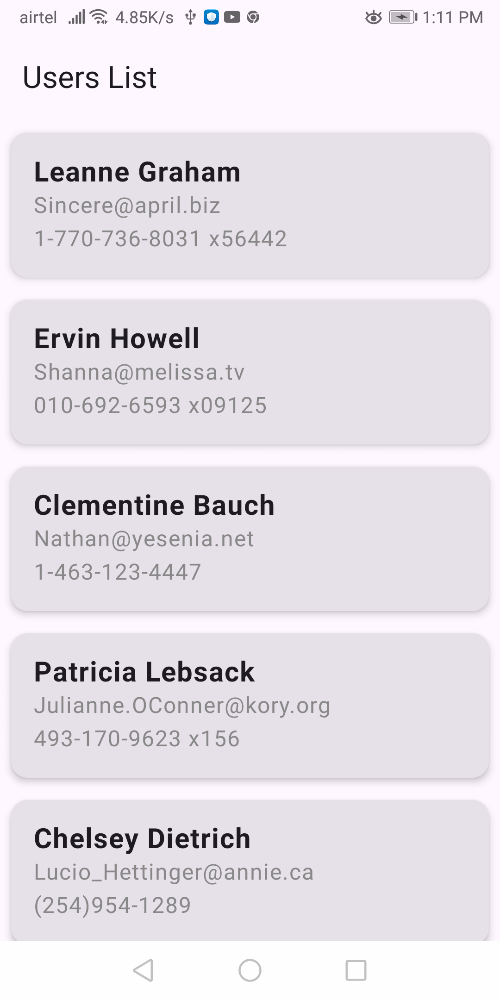
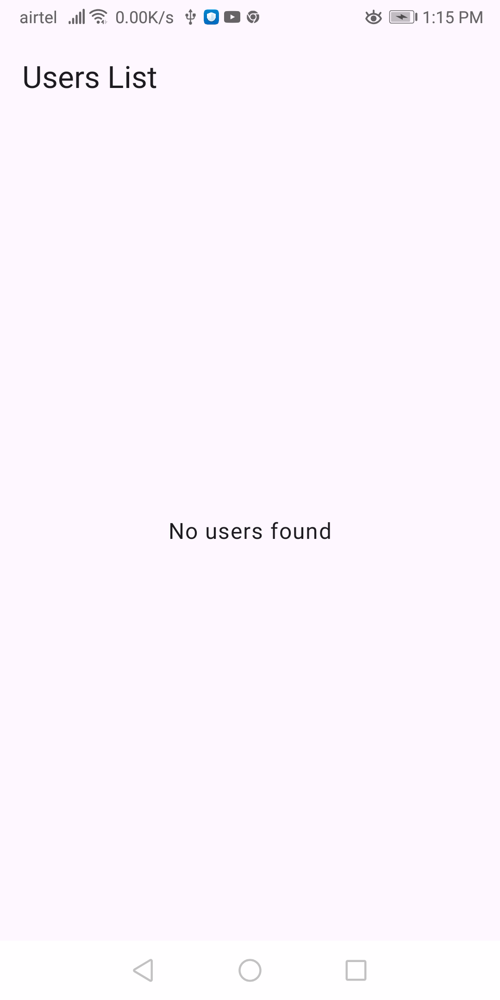

# Client-assessment-compose
**UserList Android Application**
This User List App is built using Jetpack Compose, MVVM, and Clean Architecture.

1.Fetch users from "https://jsonplaceholder.typicode.com/users"
2.UI to display the list
3.Unit test cases

**Used the following things to develop the app**
1.SOLID principles and display pattern for Presentation layer -> Repository pattern for separation of concerns.
2.Clean Code Architecture -> data, domain, presentation layers.
3.Modularisation -> Each layer has a specific responsibility.
4.DI setup -> Hilt for managing dependencies.
5.Jetpack Compose -> Modern UI framework.
6.Coroutines -> Async operations.
7.Unit tests -> Repository testing using Mockito.

**Features**
✔ Fetch user data from a REST API (jsonplaceholder.typicode.com).
✔ Display the user list using Jetpack Compose.
✔ Implements MVVM architecture with Clean Architecture.
✔ Uses Hilt for Dependency Injection.
✔ Handles errors gracefully using domain-layer error handling.
✔ Fully modularized (app, domain, data layers).
✔ Unit tests for Use Cases, Repositories, and ViewModel.

**Tech Stack**
Layer	Technology - UI (Presentation)	Jetpack Compose, ViewModel, StateFlow, MVI
Business (Domain) -	Use Cases, Repository Interfaces, Kotlin Coroutines
Data (API) - Retrofit
Dependency Injection - Hilt
Testing	- JUnit 4, MockK, Coroutines Test, Turbine

**Architecture Overview**
This project follows MVVM (Model-View-ViewModel) with Clean Architecture.

Client-assessment-compose/
├── app/                 → UI Layer (Jetpack Compose)
│   ├── di/              → Hilt DI Setup
│   ├── presentation/    → Screens, Components, viewmodel
│   ├── ui/              → App Theme
│
├── domain/              → Business Logic Layer
│   ├── di/              → Domain module dependency injection
│   ├── model/           → Entity Models
│   ├── repository/      → Repository Interfaces
│   ├── usecase/         → Use Cases
│
├── data/                → Data Layer (API)
│   ├── repository/      → Repository Implementation
│   ├── service/         → API Service (Retrofit)
│   ├── di/              → Hilt Modules
│
├── core/                → Common Utilities
│   ├── utils/           → Logger, Network Utils, Error Handling (`ResultWrapper`)

**How to Run the App**
1️⃣ Clone the repository
git clone https://github.com/SantoshKumarBogi/Client-assessment-compose
cd Client-assessment-compose
2️⃣ Run the app in Android Studio
3️⃣ Run Tests
./gradlew test

## 📸 Screenshots

###  UserList Screen

###  UserList Empty Screen

